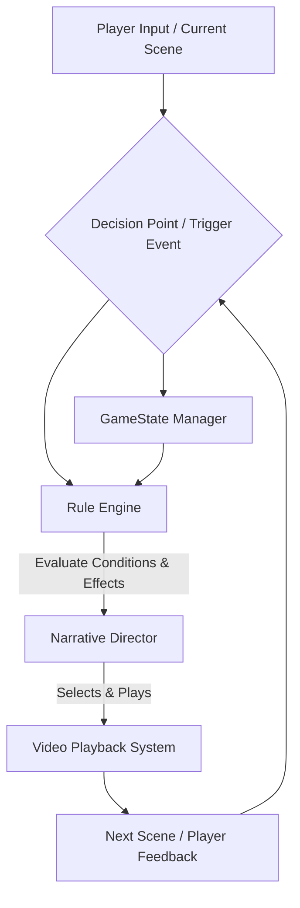

> **AI Image Prompt:** A futuristic game interface showing a branching narrative path, but instead of simple choices, it shows dynamic conditions and dice rolls influenced by character stats. Abstract geometric shapes and data streams intersect with cinematic film strips. Moody lighting, tech-noir aesthetic, deep purple and electric blue tones, ultra detailed, 8k, digital painting, cinematic lighting, concept art.

안녕하세요, 동료 개발자 여러분! 오늘 커피 한잔 하면서 나눠볼 이야기는 바로 **'System of Interactive Movie Games'**와 **'TRPG Rule Systems implemented in Code'** 이 두 가지 키워드를 어떻게 연결해서 게임의 깊이를 더할 수 있을까에 대한 제 나름의 고찰입니다. 그냥 찍어내는 듯한 인터랙티브 무비 게임에 질리셨다면, 아니면 TRPG의 복잡한 룰셋을 코드로 옮기면서 "이게 대체 어디에 쓰이지?" 하고 고민해보셨다면, 오늘 제 이야기가 조금이나마 영감을 드릴 수 있을 겁니다.

### 1. 지루한 '선택지 나열'의 문제: 인터랙티브 무비 게임의 딜레마

솔직히 말해서, 대부분의 인터랙티브 무비 게임(IMG)은 '선택형 비디오 재생기'에 가깝습니다. "A를 고르면 이 비디오, B를 고르면 저 비디오" 식의 단순 분기 구조죠. 초기에는 신선했지만, 조금만 플레이해보면 금세 한계에 부딪힙니다.

**문제점:**
1.  **얕은 플레이어 에이전시 (Shallow Player Agency):** 플레이어의 선택이 캐릭터의 본질이나 과거 경험과 무관하게 주어집니다. 내 캐릭터가 아무리 카리스마 만렙이라도, 설득 실패 비디오를 봐야 할 때가 많죠.
2.  **기하급수적인 콘텐츠 비용:** 분기점이 늘어날수록 제작해야 할 비디오 콘텐츠의 양은 기하급수적으로 증가합니다. 조금만 복잡해져도 '스파게티 브랜치'가 되어버리죠. 이는 곧 개발팀의 야근과 예산 초과로 이어집니다.
3.  **낮은 리플레이 가치:** 한 번 스토리를 보면 다음 플레이에서는 같은 선택지를 누르며 다른 비디오가 나오길 기대하기 어렵습니다. 진정한 '나만의 스토리'가 아니기 때문이죠.

이런 고민 속에서, 저는 문득 TRPG(Tabletop Role-Playing Game)의 매력에 빠져들었습니다. TRPG는 정해진 대본 없이도 플레이어의 선택, 캐릭터의 능력치, 그리고 주사위의 운이 어우러져 무한한 이야기를 만들어냅니다. 이걸 인터랙티브 무비 게임에 접목할 수 있다면?

### 2. TRPG 룰 시스템, 인터랙티브 무비에 영혼을 불어넣다

여기서부터가 진짜배기입니다. 단순히 '비디오 재생'이 아니라, **TRPG 룰 시스템을 코드로 구현하여 인터랙티브 무비 게임의 의사결정 시스템에 녹여내는 것**입니다. 플레이어의 선택이 단순히 다음 비디오를 고르는 행위가 아니라, 캐릭터의 능력치, 월드 상태, 그리고 보이지 않는 주사위 굴림(확률)에 따라 역동적으로 결과가 결정되는 구조를 만드는 것이죠.

**해결책의 핵심:** 콘텐츠(비디오)와 로직(룰 시스템)의 분리

우리가 만들고자 하는 것은, '이벤트를 만나면 다음 비디오를 튼다'가 아니라, '이벤트를 만나면 **룰 엔진에 문의하여** 다음 스토리를 결정한다'는 겁니다.

#### 2.1. 아키텍처 다이어그램: 콘텐츠 & 로직 디커플링



*   **GameState Manager:** 플레이어 캐릭터의 능력치(Strength, Charisma, Intelligence 등), 인벤토리, 관계도, 이전에 발견한 단서, 월드 플래그 등 게임의 모든 상태를 관리하는 중앙 저장소입니다. TRPG의 캐릭터 시트와 GM의 메모를 코드로 옮긴 것이죠.
*   **Rule Engine:** 게임의 모든 규칙을 담고 있습니다. 특정 상황에서 어떤 조건들이 충족되어야 하고, 그 결과 어떤 효과가 발생해야 하는지를 정의합니다. TRPG의 스킬 체크, 공격 굴림, 인카운터 룰 등이 여기에 해당됩니다.
*   **Narrative Director:** Rule Engine의 평가 결과를 바탕으로 실제로 어떤 비디오(혹은 비디오 시퀀스)를 재생할지 결정하고, GameState를 업데이트하는 역할을 합니다. GM의 역할을 자동화한 것이라고 할 수 있죠.

#### 2.2. 핵심 로직: `DecisionNode`와 `RuleEngine`의 만남

전통적인 IMG는 각 비디오에 '다음 비디오 ID'를 직접 연결했습니다. 하지만 TRPG 방식에서는 `DecisionNode`가 이러한 역할을 담당합니다.

```pseudo
// GameState.ts (예시)
class GameState {
    playerStats: { charisma: number; stealth: number; strength: number; };
    inventory: Set<string>; // 예: "열쇠", "손전등"
    worldFlags: Map<string, boolean>; // 예: "경비원_경고_상태": true

    constructor() {
        this.playerStats = { charisma: 10, stealth: 8, strength: 12 };
        this.inventory = new Set();
        this.worldFlags = new Map();
    }

    // 상태 업데이트 메서드...
}

// Condition.ts (예시)
interface ICondition {
    evaluate(gameState: GameState): boolean;
}

class StatCheckCondition implements ICondition {
    statName: string;
    difficulty: number; // TRPG의 난이도 (DC)
    rollModifier: number; // 주사위 굴림에 더해질 보너스

    constructor(stat: string, diff: number, mod: number = 0) {
        this.statName = stat;
        this.difficulty = diff;
        this.rollModifier = mod;
    }

    evaluate(gameState: GameState): boolean {
        // TRPG식 주사위 굴림: D20 + 스탯 + 모디파이어 >= 난이도
        const roll = Math.floor(Math.random() * 20) + 1; // 1d20 굴림
        const playerStat = gameState.playerStats[this.statName] || 0;
        return (roll + playerStat + this.rollModifier) >= this.difficulty;
    }
}

class HasItemCondition implements ICondition {
    itemName: string;
    constructor(item: string) { this.itemName = item; }
    evaluate(gameState: GameState): boolean {
        return gameState.inventory.has(this.itemName);
    }
}

// Effect.ts (예시)
interface IEffect {
    apply(gameState: GameState): void;
    getNextSceneId(): string; // 이 효과가 적용된 후 재생할 비디오/씬 ID
}

class PlayVideoEffect implements IEffect {
    sceneId: string;
    constructor(id: string) { this.sceneId = id; }
    apply(gameState: GameState): void { /* 비디오 재생 로직은 Narrative Director가 처리 */ }
    getNextSceneId(): string { return this.sceneId; }
}

class AddItemEffect implements IEffect {
    sceneId: string; // 다음 씬 ID를 포함할 수 있음
    itemName: string;
    constructor(id: string, item: string) { this.sceneId = id; this.itemName = item; }
    apply(gameState: GameState): void { gameState.inventory.add(this.itemName); }
    getNextSceneId(): string { return this.sceneId; }
}

// DecisionNode.ts (예시)
class DecisionNode {
    id: string; // 현재 비디오/씬 ID
    choices: Array<{
        playerOptionText: string;
        conditions: ICondition[]; // 이 선택지를 활성화/성공시키기 위한 조건들
        successEffect: IEffect; // 조건 충족 시의 효과
        failureEffect?: IEffect; // 조건 미충족 시의 효과 (선택적)
    }>;

    constructor(id: string) {
        this.id = id;
        this.choices = [];
    }

    addChoice(optionText: string, conditions: ICondition[], successEffect: IEffect, failureEffect?: IEffect) {
        this.choices.push({ playerOptionText: optionText, conditions, successEffect, failureEffect });
    }
}

// RuleEngine.ts (중앙 로직)
class RuleEngine {
    gameState: GameState;
    sceneMap: Map<string, DecisionNode>; // 모든 씬/결정 노드를 관리

    constructor(initialGameState: GameState) {
        this.gameState = initialGameState;
        this.sceneMap = new Map();
    }

    addScene(node: DecisionNode) {
        this.sceneMap.set(node.id, node);
    }

    processChoice(currentSceneId: string, choiceIndex: number): string {
        const node = this.sceneMap.get(currentSceneId);
        if (!node || !node.choices[choiceIndex]) {
            throw new Error("Invalid scene or choice.");
        }

        const choice = node.choices[choiceIndex];
        let conditionsMet = true;
        for (const condition of choice.conditions) {
            if (!condition.evaluate(this.gameState)) {
                conditionsMet = false;
                break;
            }
        }

        let effectToApply: IEffect;
        if (conditionsMet) {
            effectToApply = choice.successEffect;
        } else {
            // 실패 효과가 정의되어 있다면 그것을 사용, 없다면 성공 효과의 다음 씬으로 일단 진행하거나 기본 실패 씬으로
            effectToApply = choice.failureEffect || new PlayVideoEffect("DEFAULT_FAILURE_SCENE_ID");
        }

        effectToApply.apply(this.gameState); // 게임 상태 업데이트
        return effectToApply.getNextSceneId(); // 다음 비디오/씬 ID 반환
    }
}
```

이 `RuleEngine`은 이제 단순히 다음 비디오 ID를 반환하는 대신, 플레이어의 선택(`choiceIndex`), 현재 게임 상태(`gameState`), 그리고 정의된 조건(`conditions`)을 바탕으로 동적인 결과를 도출합니다. 예를 들어, "경비원을 설득한다"는 선택지를 고르면:

1.  `StatCheckCondition(player.charisma, 15, 0)` 이 호출되어 플레이어의 카리스마 스탯과 주사위 굴림으로 난이도 15를 통과하는지 체크합니다.
2.  `HasItemCondition("배지")` 이 호출되어 플레이어가 "배지" 아이템을 가지고 있는지 체크합니다.
3.  두 조건이 모두 충족되면 `successEffect` (예: `PlayVideoEffect("경비원_설득_성공_비디오_ID")` 와 `AddItemEffect("다음_씬_ID", "경비원_패스")`)가 적용되고, 그렇지 않으면 `failureEffect` (예: `PlayVideoEffect("경비원_설득_실패_비디오_ID")`)가 적용됩니다.

이런 방식으로, 작가와 디자이너는 더 이상 모든 비디오 분기를 직접 만들지 않아도 됩니다. 대신, **'이 상황에서 필요한 조건은 무엇이고, 성공/실패 시 어떤 비디오를 재생하고, 어떤 게임 상태를 변경할 것인가?'**만 정의하면 됩니다.

### 3. 장점과 도전 과제: 이 멋진 아이디어의 양면성

#### 3.1. 장점:
*   **깊이 있는 플레이어 에이전시:** 플레이어의 캐릭터 빌드, 이전 선택, 발견한 아이템이 실질적인 영향력을 가집니다. TRPG에서처럼 "내 캐릭터라면 이렇게 해야지!"라는 몰입감을 선사합니다.
*   **콘텐츠 제작 및 유지보수 효율성:** 비디오 콘텐츠 자체는 특정 결과에 귀속되지만, 그 결과로 이어지는 로직은 유연하게 변경될 수 있습니다. 비디오 스파게티가 아니라, 로직 스파게티를 줄이는 데 집중할 수 있습니다.
*   **높은 리플레이 가치:** 같은 선택지를 골라도 플레이어의 스탯이나 인벤토리에 따라 다른 결과가 나올 수 있으므로, 매번 새로운 경험을 할 수 있습니다.
*   **다양한 스토리텔링 가능성:** 단순한 분기가 아닌, 캐릭터의 성장에 따른 스토리 변화, 숨겨진 요소 발굴 등 복합적인 서사 구조를 구현하기 용이합니다.

#### 3.2. 도전 과제:
*   **초기 설계 및 구현 복잡성:** 단순 비디오 재생기에 비해 초기 아키텍처 설계와 룰 시스템 구현에 더 많은 노력이 필요합니다.
*   **QA의 난이도 상승:** 모든 가능한 룰 조합과 그에 따른 비디오 결과를 테스트하는 것이 쉽지 않습니다. TRPG GM이 모든 상황을 상상해야 하는 것과 비슷하죠.
*   **밸런싱 문제:** 스탯, 난이도, 주사위 확률 등을 잘 밸런싱하지 못하면 플레이어가 너무 쉽게 성공하거나 너무 자주 좌절할 수 있습니다.
*   **콘텐츠와 로직의 동기화:** 룰 시스템이 정의하는 조건과 결과에 맞는 비디오 콘텐츠를 제작해야 하므로, 개발팀과 콘텐츠팀 간의 긴밀한 협업이 필수적입니다.

### 4. 나의 견해: 스토리텔링의 미래를 위한 투자

저는 이 방식이 인터랙티브 스토리텔링 게임의 미래에 매우 중요한 방향이라고 확신합니다. 물론 초기에는 공수가 많이 들고 복잡하겠지만, 장기적으로는 더 깊이 있고, 더 유연하며, 훨씬 풍부한 게임 경험을 제공할 수 있습니다.

단순히 "멋진 그래픽의 비디오"를 보여주는 것을 넘어, **"내 선택과 내 캐릭터가 정말로 의미 있는 결과를 만들어낸다"**는 강력한 메시지를 전달할 수 있게 되는 거죠. 마치 TRPG에서 뛰어난 GM이 플레이어의 모든 행동에 의미를 부여하는 것처럼 말입니다.

만약 여러분이 인터랙티브 무비 게임을 기획하고 있거나, 기존의 고정된 서사 구조에 한계를 느끼고 있다면, TRPG의 룰 시스템을 코드로 구현하는 방식에 대해 진지하게 고민해보시길 권합니다. 그것은 단순히 기술적 투자를 넘어, 플레이어에게 잊지 못할 '나만의 이야기'를 선물하는 가장 강력한 방법이 될 테니까요.

다음 포스팅에서는 이 `RuleEngine`을 더 효율적으로 관리하기 위한 데이터 기반 설계(Data-Driven Design)와 DSL(Domain-Specific Language) 활용법에 대해 다뤄볼까 합니다. 그때까지, 여러분의 코드에 항상 행운이 있기를!
